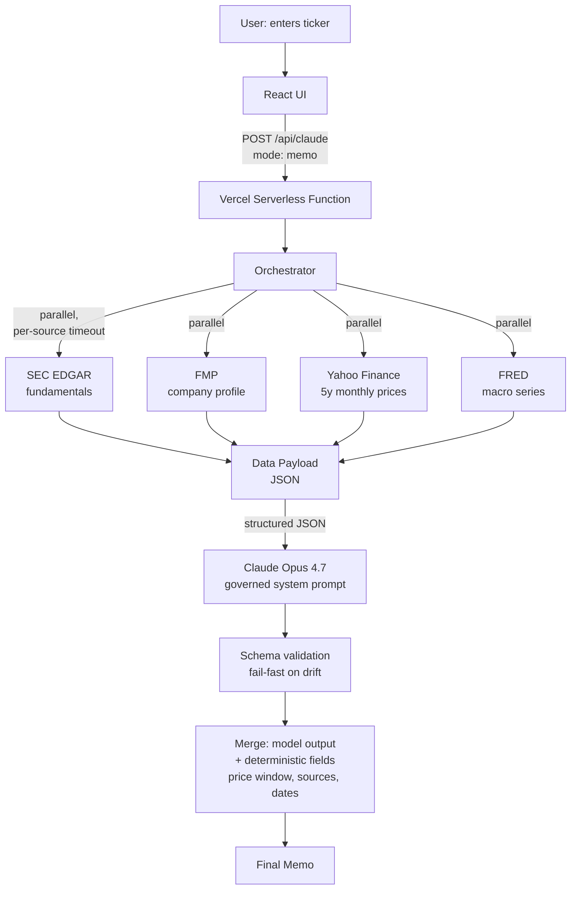

# Equity Research Assistant

An AI-powered equity research memo generator. Enter a ticker; get a structured, source-grounded research memo built from real SEC filings, market data, and macro context.

## What it does

Given a stock ticker, the application:

1. **Pulls audited financial fundamentals** from SEC EDGAR (latest 10-K and 10-Q)
2. **Pulls a 5-year monthly price history** from Yahoo Finance
3. **Pulls company profile data** from Financial Modeling Prep
4. **Pulls 24 months of macro context** from FRED (Fed Funds, 10Y Treasury, Unemployment)
5. **Hands the combined payload to Claude Opus 4.7** with a governed system prompt
6. **Returns a structured, seven-section research memo** formatted for analyst review

The full round-trip takes 15–30 seconds and costs ~$0.12 per memo at current API rates.

## Why I built it

I lead Human Capital FP&A and have been spending personal time on AI tooling alongside the enterprise's broader AI exploration. Most finance-focused AI demos either don't understand the rigor finance requires, or finance teams build them in ways that aren't defensible in a controllers' review. This project is a working answer to the question: **what does a finance-grade AI deliverable actually look like end-to-end?** The equity research memo is the demo. The patterns it uses are general — the same shape applies to variance commentary, board narratives, KPI explanations, forecast write-ups, and other finance-team deliverables that combine pulled data with structured analytical prose.

## What this build gets right (and where it falls short)

Five things matter for AI deliverables in a finance context, and this build is a working example of each. Where the build falls short of production quality is noted under "What's intentionally not here."

1. **Multi-source data orchestration** with graceful degradation when sources fail
2. **Governance design for AI outputs:** explicit no-hallucination rules, structured citations, "missing data" surfacing, and a hard separation between what the LLM produces (analysis) and what code produces (citations, math, dates)
3. **Judgment about LLM-vs-deterministic boundaries** — the model writes prose; code computes price windows, validates JSON, formats currency, and assembles sources
4. **Real-world data quality handling** — including XBRL tag instability across companies, restatement deduplication, API tier limitations, and bank-specific reporting conventions
5. **Polished delivery** — a document-aesthetic React UI, not a JSON dump

## Sample output

Below is an excerpt from the **ALLY (Ally Financial)** memo. The full memo runs ~1,500 words across seven sections.

> **Thesis — Equal-weight**
>
> Ally's fundamentals show a business in the early stages of an earnings recovery from a difficult 2023–2024 trough, with FY2025 net income of $852M up 28% year over year and Q1 2026 diluted EPS of $0.93 annualizing meaningfully above the FY2025 run-rate of $2.37. Stockholders' equity has rebuilt to $15.5B from a 2022 low of $12.9B, and the falling Fed Funds rate (from 5.33% in mid-2024 to 3.64% in early 2026) should ease funding cost pressure on a deposit-funded auto lender. Offsetting these positives: earnings remain well below the 2021 peak of $3.06B, the stock trades near the middle of its 5-year range with limited margin of safety, and unemployment has drifted up to 4.3–4.4%, a concerning signal for subprime auto credit performance.

The memo continues with Business Overview, Financial Highlights (with a structured key-figures table), Valuation Context (with a deterministic 5-year price window), Macro Context, Key Risks (numbered, each anchored to specific payload data), and Data Caveats. The full memo cites SEC EDGAR, Financial Modeling Prep, Yahoo Finance, and FRED at the bottom.

## Architecture



### Key design decisions

**1. The LLM produces analysis; code produces everything else.**
The orchestrator deterministically computes the 5-year price window (current close, high/low, return) and the sources array. The LLM never does arithmetic on price arrays or generates citation metadata — both are classic LLM failure modes. The model is told explicitly what fields will be appended deterministically so it doesn't try to produce them.

**2. Fail-fast on schema drift, don't paper over it.**
If Claude returns malformed JSON or missing required fields, the orchestrator throws. No silent repair, no retry, no truncation tolerance. Drift is a signal, not noise.

**3. Variable schema by data availability, with explicit gap surfacing.**
When a data source fails (e.g., FMP's free tier paywalls mid-cap tickers on some endpoints), the corresponding section is `null` and an explicit note appears in `dataAvailability`. The system prompt requires the model to acknowledge gaps inline rather than silently filling them.

**4. Honest about domain limits.**
EDGAR's generic XBRL tags don't fully cover banks — they capture non-interest revenue but miss the net-interest-income line. Rather than chase tag fallbacks across every bank's reporting convention, the system prompt instructs the model to detect financial-sector companies (revenue under 5% of total assets is the diagnostic) and reason qualitatively from balance sheet and per-share data instead. The model handles ALLY, JPM, and other banks coherently because it knows what to do when the data isn't complete.

## Tech stack

| Layer | Technology |
|---|---|
| Frontend | React + Vite, Tailwind CSS v4 |
| Hosting | Vercel (serverless functions) |
| LLM | Anthropic Claude Opus 4.7 |
| Data sources | SEC EDGAR, Financial Modeling Prep, Yahoo Finance (yahoo-finance2), FRED |
| Language | JavaScript (ESM) |

## Run it locally

Requires Node 22+ and API keys for Anthropic, Financial Modeling Prep, and FRED.

```bash
git clone https://github.com/mtclark985/equity-research-assistant.git
cd equity-research-assistant
npm install
```

Create `.env.local` in the project root:

```
ANTHROPIC_API_KEY=sk-ant-...
FMP_API_KEY=...
FRED_API_KEY=...
SEC_USER_AGENT=Your Name your.email@example.com
```

Then:

```bash
vercel dev
```

Open http://localhost:3000 and try AAPL, MSFT, ALLY, or JPM.

## What's intentionally not here (yet)

These are deliberate Phase 1 scoping decisions, not oversights:

- **No persistence.** Memos are not saved.
- **No subagent layer.** A single Claude call produces the memo. A planned next step is to introduce specialized subagents (comparables selection, financial summary, risk flagging) following the pattern Anthropic shipped with its finance agent templates.
- **No streaming progress.** The user sees a skeleton during the 15–30 second generation.
- **No mobile responsive layout.** Desktop-first for the document aesthetic.
- **No fast-fail ticker validation.** Invalid tickers fail after the full orchestration runs.
- **No charts.** Numbers and prose carry the memo.

## Phase 2

Several of these would be more useful as enterprise patterns than as solo extensions of this project — particularly persistence, subagents, and streaming. They're listed here as natural next steps in this codebase, but each is a pattern worth thinking about more broadly.

- Persistence: research history, cached fundamentals, user notes
- Subagent layer: comparables, financial summary, risk flagging
- Streaming generation with progress updates
- Watchlist + cross-ticker comparisons
- Charts for price action and key financial trends
- Mobile responsive layout
